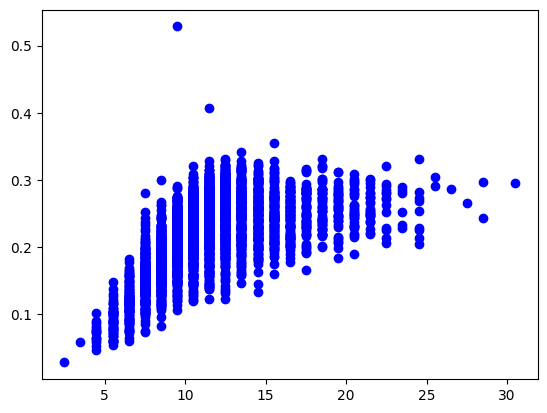
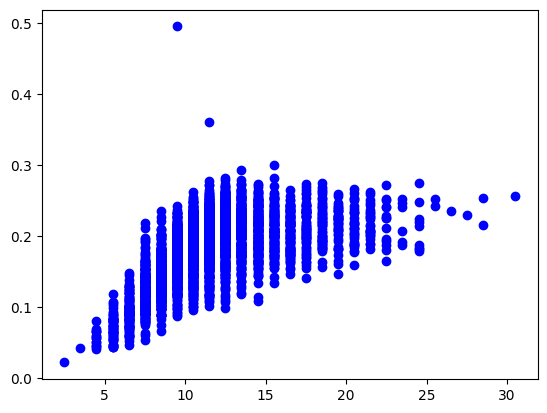
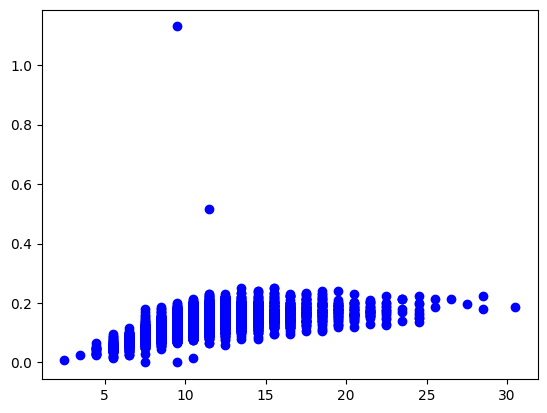
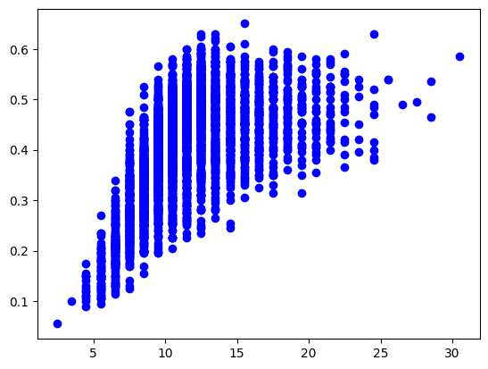
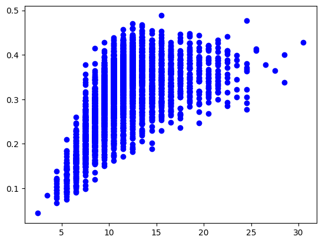
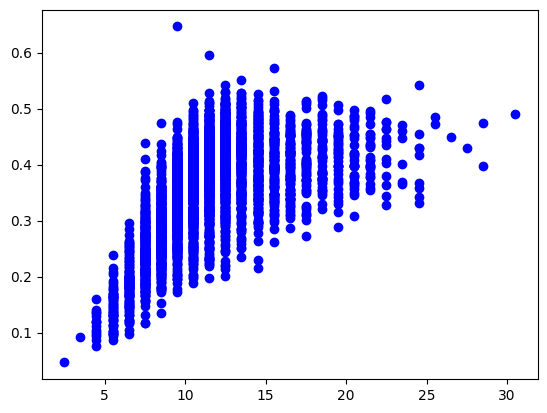
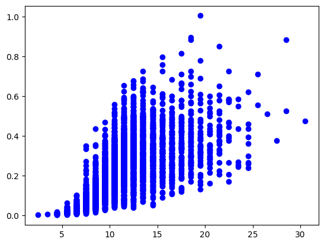
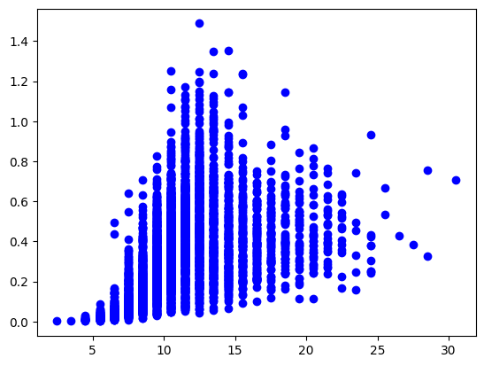
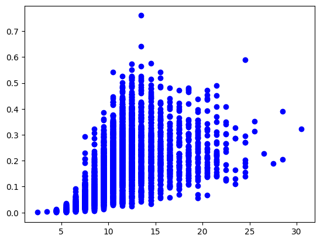
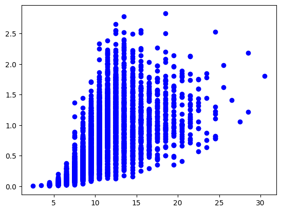

# Observations
list of observations made so far during data analysis

# Log Curves

the average of length and height creates a logarithmic curve

and so does the average of diameter and height

a more drastic logarithmic curve is generated by the height vs age graph

# First Grade Polynomial curves

first grade polynomial lines are generated by diameter vs age

length-diameter average

length-diameter-height average

length vs age

# Exponential curves

weights put against age generates an exponential curve
against shell weight

against shucked weight

against viscera weight

against whole weight
